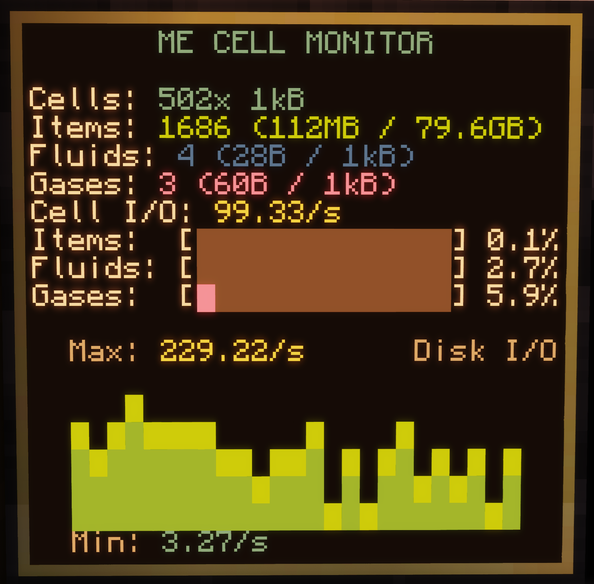
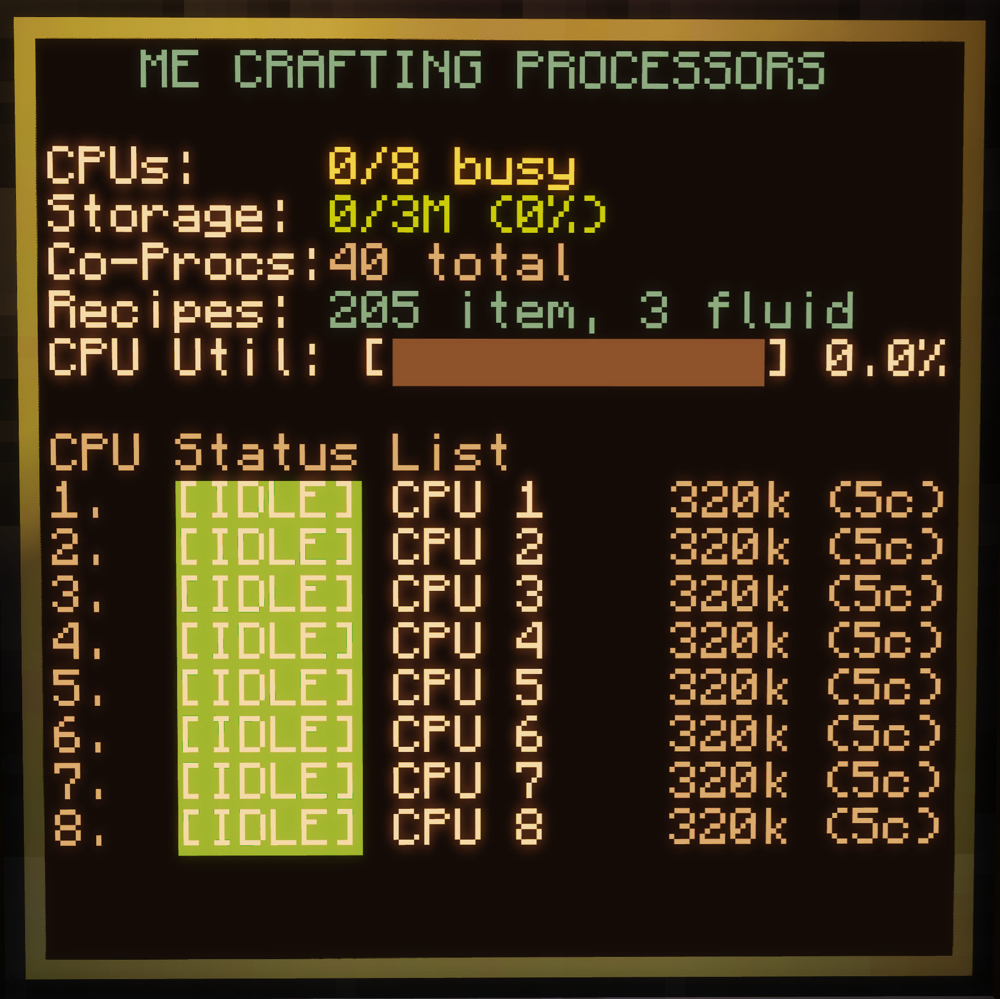
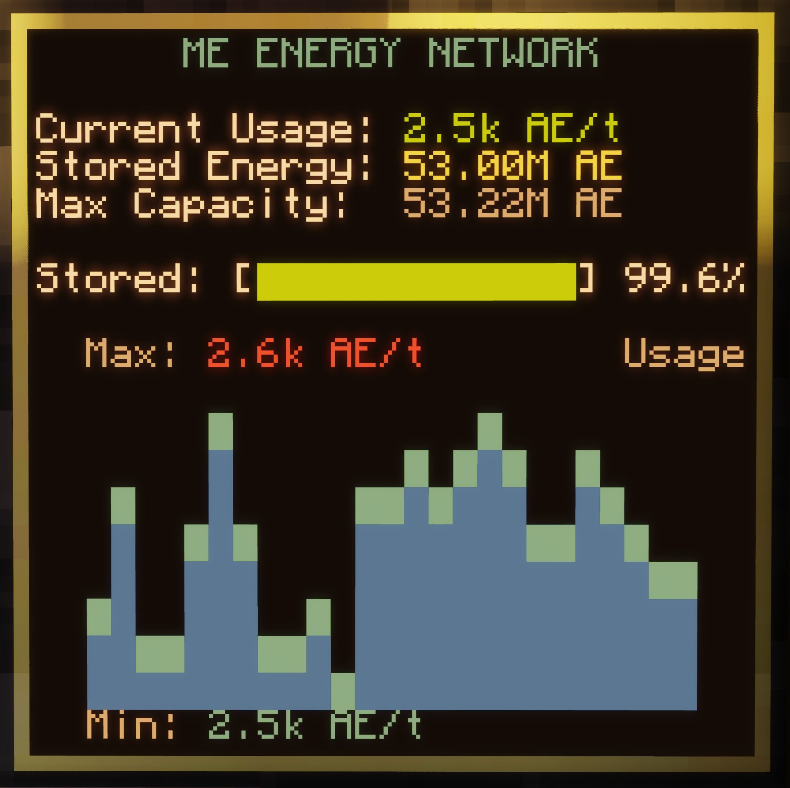
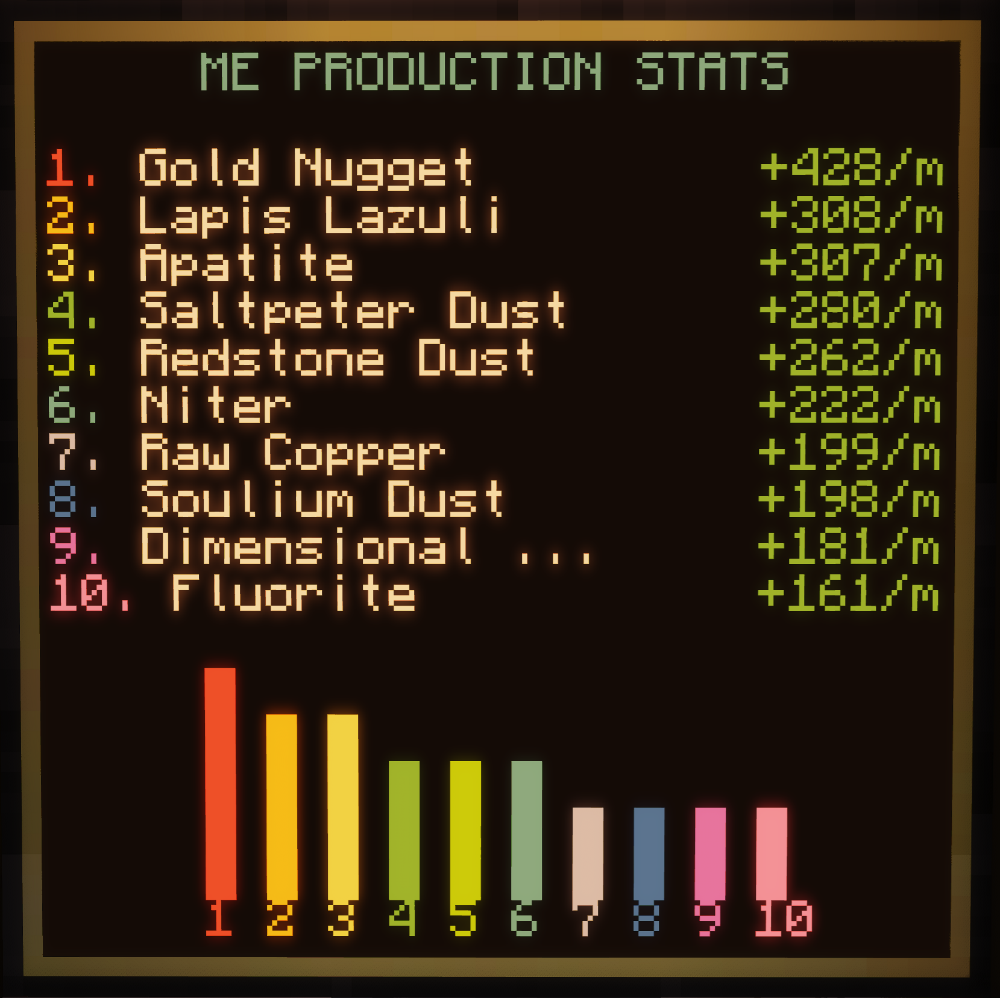
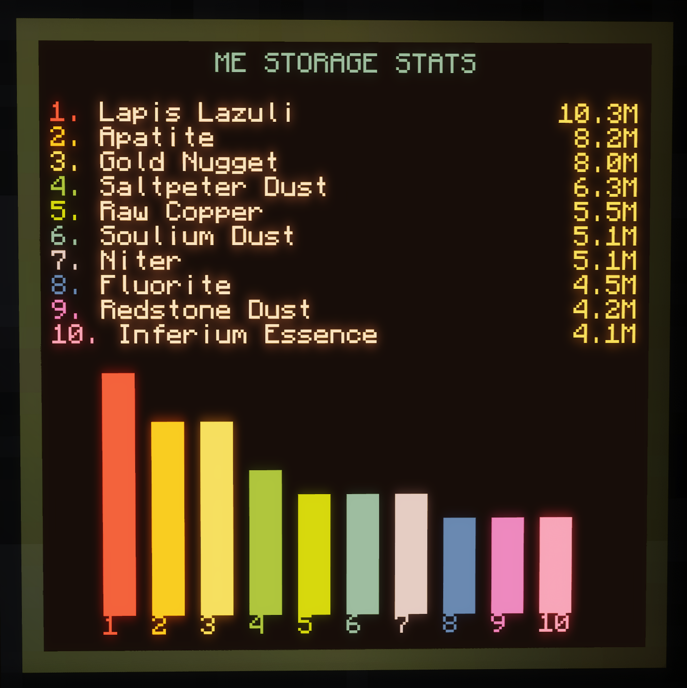

# ComputerCraft AE2 Monitor Suite


A fix for 1.21.1+ and AP version 0.7+ for the collection of helpful monitoring scripts for Applied Energistics 2 (AE2) networks using **ComputerCraft/CC: Tweaked** and **Advanced Peripherals** in Minecraft. Displays useful info on ME Cell IO, crafting CPUs, energy usage, network item inputs, and top stored items.

This will also work for older versions some day, as the new ME bridge system will be backported.

Designed to fit on a standard **3x3 Advanced Monitor** (approx. 39x19 text scale 1.0). Tested in ATM10 7.3 (1.21.1, AE2 19.2.17 and Advanced Peripherals 0.7.62b).

---

## Screenshots

Here are some previews of the monitors in action:

#### ME Disk Monitor (`disk.lua`)


#### Crafting CPU Monitor (`cpus.lua`)


#### Energy Network Monitor (`energy.lua`)


#### Inputs Monitor (`inputs.lua`)


#### Storage Monitor (`storage.lua`)


---

## Hardware Setup

To run these monitors in your world, you will need:

1. **Advanced Computer**
2. **ME Bridge** (from *Advanced Peripherals*), placed adjacent to the computer and connected to ME network
3. **Advanced Monitors** arranged in a:
   * **3x3 Grid** (Optimal experience: `width = 39`, `height = 19`)
   * **2x2 Grid** (Compact layout (not fully tested): `width = 29`, `height = 12`)


## Scripts

### 1. `disk.lua` — Disk & Storage Cell Monitor
Monitors disk capacity, active cell distributions, and network database statistics.
* **Cell Layout**: Shows the exact breakdown of cells loaded into your drives by capacity (e.g., `Cells: 1x 256kB, 12x 64kB`).
* **Storage Breakdown**: Displays stored unique types, used bytes, and max capacities for **Items** (rounded to 0 decimal places), **Fluids**, and **Mekanism Gases** (rounded to 2 decimal places).
* **I/O Area Chart**: Draws a rolling area chart showing read/write transaction speed (items/fluids per second) over time.
#### To install:
`wget https://raw.githubusercontent.com/ZinebaBoi/ComputerCraft-AE2-Monitor-Suite/refs/heads/main/disk.lua`
  

### 2. `cpus.lua` — Crafting CPU Monitor
Tracks crafting CPUs, active tasks, memory usage, and recipe database status.
* **Server Blades Layout**: Displays each crafting CPU as a slot in a server rack. Idle CPUs are marked gray, and busy CPUs pulse in orange/yellow.
* **Utilization & Stats**: Tracks allocation capacity, active co-processors, and lists active jobs.
* **Recipe DB**: Displays total encoded recipes in your pattern provider storage (e.g., `Recipes: 412 item, 32 fluid`).
* **Pagination**: Automatically paginates if you have more CPUs than can fit on the monitor.
#### To install:
`wget https://raw.githubusercontent.com/ZinebaBoi/ComputerCraft-AE2-Monitor-Suite/refs/heads/main/cpus.lua`

### 3. `energy.lua` — ME Energy Monitor
Keeps a close eye on your network power grids.
* **Horizontal Bar**: Displays a progress bar of stored AE energy compared to maximum buffer.
* **Power Graph**: Plots a shaded history area chart showing network power consumption rates with dynamic min/max labels.
#### To install:
`wget https://raw.githubusercontent.com/ZinebaBoi/ComputerCraft-AE2-Monitor-Suite/refs/heads/main/energy.lua`

### 4. `inputs.lua` — Production Rate Monitor
Tracks production rates of items inside the system to analyze factory output.
* **EMA Smoothing**: Tracks changes in item quantities smoothed by an Exponential Moving Average (EMA) over a 1-minute window.
* **Production Bars**: Renders vertical, colored progress bars at the bottom of the screen to visualize rates.
#### To install:
`wget https://raw.githubusercontent.com/ZinebaBoi/ComputerCraft-AE2-Monitor-Suite/refs/heads/main/inputs.lua`

### 5. `stored.lua` — Stored Items Monitor
Displays a list of the top 10 items stored in the network.
* **Noise Filter**: Ignores common garbage block items (like Cobblestone or Netherrack) so you can focus on valuable assets.
* **Visual Gauges**: Includes vertical level bars representing quantities.
#### To install:
`wget https://raw.githubusercontent.com/ZinebaBoi/ComputerCraft-AE2-Monitor-Suite/refs/heads/main/stored.lua`


---

## Installation & Usage

1. Put the files into your computer's directory: `../world/computercraft/computer/#/` or use wget in the computer.
2. Connect your **ME Bridge** and **Advanced Monitor** and turn the computer on.
3. Run any script by invoking the filename:
   ```bash
   disk
   ```
5. To run a script on startup, install and edit `startup.lua`:
   ```lua
   shell.run("disk")
   ```
If the script(s) doesn't/don't auto-detect the monitors, then configure the monitor side/name at the top of each script:
   ```lua
   -- Scripts will automatically scan and detect standard monitor grids.
   -- You can optionally lock a script to a specific peripheral by side/name:
   local targetMonitor = "monitor_3"
   ```

---

## Layout Design Principles

* **Flicker-Free Rendering**: Rather than drawing pixel-by-pixel or cell-by-cell (which causes heavy screen flashing in ComputerCraft), all scripts use a double-buffered style drawing full-width lines using `device.blit()` string functions.
* **Dynamic Sizing**: Automatically drops decimal values, shortens labels (e.g., `Items` instead of `Item Storage`), and scales down charts to fit smaller 2x2 monitors without wrapping text or causing screen clipping.
